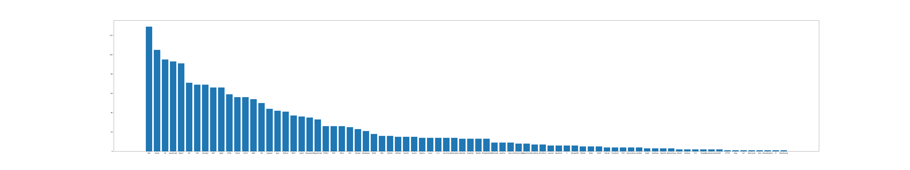

# Seek_Spider
.png)
## About
This program will gather data on Develop jobs associated with programming languages from Seek.com.au. Its purpose is to offer insights for individuals intrigued by programming, helping them discern the prevalent tools used by Australian companies. Moreover, the program can generate visualizations to enhance the clarity of identified trends. This comprehensive resource will aid individuals in identifying appropriate learning pathways.


## Overview

In `main.py`, the program begins by scraping the Seek website to locate job listings in the field of development. It then proceeds to extract job descriptions from each listing page. These descriptions are subsequently compared against a predefined keyword library to conduct statistical analysis. Notably, if a keyword appears multiple times on a page, it is only counted once. Each search page contains 22 job listings, and by default, the program searches through 20 pages (which you can change the desired param at `spider.crawl_pages()`) , aggregating data from approximately 440 job listings to create a keyword ranking. Finally, users have the option to generate either a bar chart illustrating the relative frequencies of each keyword or a text-based word cloud image for simplified comprehension. Although all image outputs are managed separately within the visualize.py file, they can be operated on directly within main.py.

---
In `visualize.py`: This file contains a class named Visualize, which is responsible for visualizing data extracted from a CSV file. It utilizes the pandas library to read data from the "ranking.csv" file and matplotlib to generate visualizations. The class provides three main methods:

- `bar()`: This method generates a vertical bar chart based on the keyword frequency data extracted from the CSV file. The resulting chart is saved as "bar_v.png".

- `bar_h()`: Similar to `bar()`, this method generates a horizontal bar chart based on the keyword frequency data. The resulting chart is saved as "bar_h.png".

- `cloud()`: This method generates a word cloud visualization based on the keyword frequency data. The resulting word cloud image is saved as "wordcloud.png".
Overall, this file serves the purpose of visualizing keyword frequency data extracted from the "ranking.csv" file, providing users with graphical representations of the data for better understanding and analysis.
---

In `tests` folder: 

- The `test_spider.py `script in the tests directory serves the purpose of validating the functionalities of the primary class Spider. This Spider class is primarily responsible for fetching developer-related job listings from specified links on the Seek website. 

- During the testing phase, the `get_res` function is initially used to verify the functionality of retrieving responses from the website. 

- Subsequently, the `find_sub_urls` function is tested to confirm the successful extraction of sub-links from the main link. 

- Following this, keyword processing within the program is thoroughly tested to ensure accurate extraction and handling of keywords. 

- Additionally, the program is subjected to tests to validate its capability of saving data to CSV files and fetching information from multiple pages. The overarching goal of the testing process is to ensure the robust performance of the Spider class under diverse conditions.

## Design Debated
- **Scraping progress**: Upon completing the initial version, I encountered lengthy search times while scraping job listings page by page. To address this, I experimented with parallel searching and keyword analysis. However, these attempts were thwarted by restrictions imposed by the Seek website, prompting a return to single-threaded keyword analysis. Despite the increased time required for this approach, it proved adequate given the relatively low frequency of job listing updates.

- **Statistics**: In response to the issue of repeated occurrences of the same keyword on certain pages, I made a adjustment to the program. It now guarantees fairness in statistical analysis by counting each keyword only once per page.

- **Keyword extraction**: my initial approach involved using natural language processing libraries, but the results were marred by irrelevant terms. Seeking a more efficient solution, I turned to ChatGPT for assistance in generating a curated list of programming-related keywords, sparking an interest in leveraging AI for keyword extraction in future iterations.

- **File Output**: After considering .txt and SQL formats, CSV was chosen for its simplicity in generating intuitive and easy-to-understand images. While data querying functionality is not presently needed, transitioning to SQL data format is a possibility for future iterations.

## Quickstart
Clone repo:
```
git clone https://github.com/whsiaor/Seek_Spider.git && cd Seek_Spider
```
Installation:
```bash
pip install requirements.txt
```
Run program:
```
python main.py
```
>   Upon execution, the program fetches data and saves it directly in the ranking.csv file. By default, it performs keyword analysis once and generates a word cloud image. If you want to additionally generate a bar chart, you don't have to run all program again, just simply comment out the scrip and uncomment `Visualize.bar()` before running the program again, it will using the data you just generated and produce a bar chart. See exemple:

```
# spider = Spider()
# spider.crawl_pages() 
# Visualize.cloud()

Visualize.bar()
```

> The data `ranking.csv` will reset every time you run the `test_spider.py` or `spider.crawl_pages()`.

## Bar chart


## Contributing
Contributions are appreciated! If you'd like to make changes, fork the project, apply your updates, and then submit a pull request. Prior to making major changes, please consider opening an issue to facilitate discussion.
## License
This project is licensed under the Apache License 2.0 - see the LICENSE file for details.

## Acknowledgments
This README content was assisted by Generative AI, aiming to provide accurate and efficient information for better understanding.